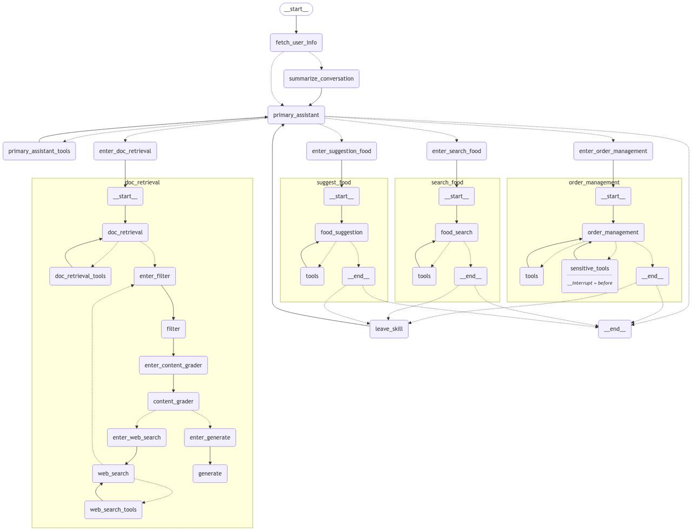

# ChatFood: A LLM-powered Agentic Food Ordering Assistant

## 📌 Overview
ChatFood is an intelligent chatbot designed as part of an NLP course project using the **LangGraph** framework. It acts as a virtual assistant in a hypothetical food ordering application, offering users various services, including:

- 📖 **Providing general and specialized food-related information**
- 🍽️ **Recommending dishes based on user preferences**
- 🔍 **Searching for available foods in restaurants**
- 📦 **Tracking and canceling orders**
- 🛠️ **Managing user interactions through an intuitive UI (Chainlit)**

This project allows students to gain hands-on experience in chatbot development, **multi-agent architectures, RAG-based retrieval, LangGraph workflows, and database management**.

## 🎯 Objectives
This project aims to:
- Introduce **LangGraph** for designing an intelligent chatbot with agent-based reasoning.
- Demonstrate the integration of tools like **Tavily**, **LlamaParse**, **LanceDB**, and **Chainlit**.
- Teach best practices in **chatbot architecture**, **LLM-driven interactions**, and **structured output processing**.
- Encourage students to explore **document-based retrieval (RAG)** and **multi-stage reasoning** using **ReAct** and **Plan-and-Execute** architectures.

## 🚀 Features
### ✅ Foods and Meals QA (Information Retrieval)
- Uses **Hybrid RAG (Retrieval-Augmented Generation)** to provide detailed food-related knowledge.
- Retrieves structured information from **a knowledge base (book corpus) or online sources** (via Tavily API).

### ✅ Food Recommendations
- Implements **multi-step reasoning** to suggest relevant dishes based on user preferences.
- Ensures that recommended dishes are available in listed restaurants.

### ✅ Order Management
- Users can **check order status**, **cancel an order**, and **leave a review**.
- The chatbot interacts with a **SQLite-based order database**.

### ✅ Food Search
- Allows users to **search for foods in restaurants** by name or category.
- Uses **natural language search** with **fuzzy matching**.

### ✅ Chainlit UI
- Provides a **web-based chat interface** using **Chainlit**.
- Supports real-time interaction with chatbot responses.

## 🏗️ Architecture
ChatFood is built using **LangGraph**, leveraging its graph-based workflow to create an **efficient and scalable agentic chatbot**. The system consists of:
- **Food Info Agent**: Handles food-related queries (via RAG & Tavily API).
- **Recommendation Agent**: Suggests food items based on user inputs.
- **Order Manager**: Manages orders (checking status, cancellations, and reviews).
- **Food Search Module**: Retrieves food details from the database.

📌 **Graph View of the ChatFood Workflow:**  


## 📽️ Demo Video
Here is a video demo of the project (by Mobin Tirafkan):


https://github.com/user-attachments/assets/f7a67270-803b-41cb-9264-2c82f3b39718


## ⚙️ Tech Stack
- **LangGraph** (for workflow orchestration)
- **LanceDB** (for vector storage & retrieval)
- **Tavily API** (for real-time web search)
- **LlamaParse** (for document parsing)
- **SQLite** (for order management database)
- **Chainlit** (for UI interface)

## 🛠️ Installation & Setup
```sh
# Clone the repository
git clone https://github.com/your-repo/chatfood.git
cd chatfood

# Create a virtual environment (optional but recommended)
python -m venv env
source env/bin/activate  # On Windows use 'env\Scripts\activate'

# Install dependencies
pip install -r requirements.txt

# Run the chatbot in the terminal
python chatfood.py

# Run with Chainlit UI
chainlit run chatfood_ui.py
```

## 🏁 Usage Guide
- **To get general food information:**
  - "What is Sushi?"
  - "Is eating yogurt with kebab unhealthy?"
- **To search for food availability:**
  - "Which restaurants serve Ghormeh Sabzi?"
  - "How much is a Pepperoni Pizza at Milad Restaurant?"
- **To track an order:**
  - "What is the status of my order #456?"
- **To cancel an order:**
  - "Cancel my order #123."
- **To get food recommendations:**
  - "I want a spicy fast food option. What do you suggest?"

## 📚 Project Structure
```
📂 chatfood/
 ├── 📜 README.md             # Project documentation
 ├── 📜 requirements.txt      # Dependencies
 ├── 📜 chatfood.py           # Main chatbot script
 ├── 📜 chatfood_ui.py        # Chainlit UI
 ├── 📂 sample-solutions/     # Graph view & demo video
 ├── 📂 db/                   # SQLite database for orders & food items
 ├── 📂 utils/                # Helper functions
 ├── 📂 models/               # LangGraph nodes & logic
```

## 🏆 Bonus Features
💡 **(Optional Advanced Features)**
- **Optimized Long Conversations**: Implements trimming, summarization, or filtering for chat history.
- **Streaming Responses**: Supports **incremental response updates** for better UX.
- **Human-in-the-loop (HITL)**: Implements **explicit confirmations for sensitive actions** like order cancellation.

